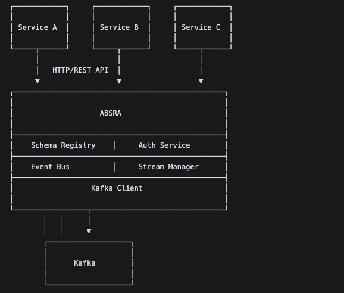
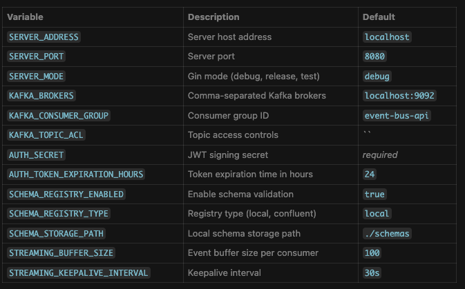

# ABSRA - Event Bus Abstraction Layer


**ABSRA** provides a clean HTTP API on top of Apache Kafka.  
It lets microservices publish and consume events without embedding Kafka client code—  
handling schema validation, access control, and real‑time streaming for you.

## Problem Statement

Microservices often communicate via events, but direct Kafka integration brings:

- Tight coupling to a specific broker technology  
- Steep learning curve and operational complexity  
- Security risks from granting broker access  
- Schema evolution challenges and data inconsistencies  
- Boilerplate consumer/producer code in every service  

**ABSRA** solves these by exposing a simple, secure REST interface that:

1. Validates events against JSON schemas  
2. Enforces topic‑level access control  
3. Publishes to Kafka under the hood  
4. Streams events to clients via Server‑Sent Events (SSE)  

## Features

- 🔒 JWT‑based authentication & per‑topic ACL  
- 📐 JSON Schema registry and validation  
- 🔄 Real‑time SSE subscription for event streams  
- ⚙️ Zero‑Kafka‑client dependency in your services  
- 🔍 Discoverable event types & automatic topic creation  

## Architecture



# Getting Started

## Prerequisites

- Go 1.23.2 or higher
- Docker and Docker Compose
- Kafka cluster (or Docker for local development)

## Installation

1. Clone the repository:
```bash
git clone https://github.com/nomannaq/project-absra.git
cd project-absra
```
2. Configure your environment:
```bash
touch .env
#Will add an example .env later
```
3. Run the service:
```bash
go run cmd/server/main.go
```
# Usage
## Authentication
## Obtain an authentication token:
```bash
curl -X POST http://localhost:8080/api/v1/auth/token \
  -H "Content-Type: application/json" \
  -d '{
    "client_id": "order-service",
    "secret": "your-secret"
  }'
```
## Define Event Types with Schemas
## Register a new event type with its JSON schema:
```bash
curl -X POST http://localhost:8080/api/v1/event-types \
  -H "Authorization: Bearer YOUR_TOKEN" \
  -H "Content-Type: application/json" \
  -d '{
    "type": "order.created",
    "schema": {
      "type": "object",
      "properties": {
        "order_id": {"type": "string"},
        "customer_id": {"type": "string"},
        "items": {
          "type": "array",
          "items": {
            "type": "object",
            "properties": {
              "id": {"type": "string"},
              "quantity": {"type": "integer"},
              "price": {"type": "number"}
            },
            "required": ["id", "quantity", "price"]
          }
        },
        "total": {"type": "number"}
      },
      "required": ["order_id", "customer_id", "items", "total"]
    }
  }'
```
## Publish Events
## Publish an event (ABSRA validates it against the schema):

```bash
curl -X POST http://localhost:8080/api/v1/events/order.created \
  -H "Authorization: Bearer YOUR_TOKEN" \
  -H "Content-Type: application/json" \
  -d '{
    "order_id": "ORD-12345",
    "customer_id": "CUST-789",
    "items": [
      {
        "id": "PROD-001",
        "quantity": 2,
        "price": 29.99
      }
    ],
    "total": 59.98
  }'
```
## Consume Events via Streaming
## Subscribe to events using Server-Sent Events (SSE):

```bash
curl -N -H "Authorization: Bearer YOUR_TOKEN" \
  "http://localhost:8080/api/v1/streams?topic=order.created&topic=user.updated"
  ```
# API Reference

| Variable                        | Description                          | Default             |
|--------------------------------|--------------------------------------|---------------------|
| `SERVER_ADDRESS`               | Server host address                  | `localhost`         |
| `SERVER_PORT`                  | Server port                          | `8080`              |
| `SERVER_MODE`                  | Gin mode (debug, release, test)     | `debug`             |
| `KAFKA_BROKERS`                | Comma-separated Kafka brokers        | `localhost:9092`    |
| `KAFKA_CONSUMER_GROUP`         | Consumer group ID                    | `event-bus-api`     |
| `KAFKA_TOPIC_ACL`              | Topic access controls                | ``                  |
| `AUTH_SECRET`                  | JWT signing secret                   | `required`          |
| `AUTH_TOKEN_EXPIRATION_HOURS` | Token expiration time in hours       | `24`                |
| `SCHEMA_REGISTRY_ENABLED`      | Enable schema validation             | `true`              |
| `SCHEMA_REGISTRY_TYPE`         | Registry type (local, confluent)     | `local`             |
| `SCHEMA_STORAGE_PATH`          | Local schema storage path            | `./schemas`         |
| `STREAMING_BUFFER_SIZE`        | Event buffer size per consumer       | `100`               |
| `STREAMING_KEEPALIVE_INTERVAL` | Keepalive interval                   | `30s`               |
# Configuration
## ABSRA is configured via environment variables, which can be provided in a .env file:


# Benefits for Microservices Teams
- Focus on Domain Logic: Teams can focus on their business logic rather than messaging infrastructure.
- Simplified Development: No Kafka client libraries needed in every service.
- Consistency: Enforced data structures and formats via schema validation.
- Security: Fine-grained access control without direct Kafka access.
- Technology Independence: Underlying message broker can be changed without affecting services.
- Cross-Language Support: Any service that can make HTTP requests can use the event bus.
# Contributing
## Contributions are welcome! Please feel free to submit a Pull Request.

1. Fork the repository.
2. Create your feature branch (git checkout -b feature/amazing-feature).
3. Commit your changes (git commit -m 'Add some amazing feature').
4. Push to the branch (git push origin feature/amazing-feature).
5. Open a Pull Request.
# License
## This project is licensed under the MIT License - see the LICENSE file for details.

Built with ❤️ by Nouman Qureshi